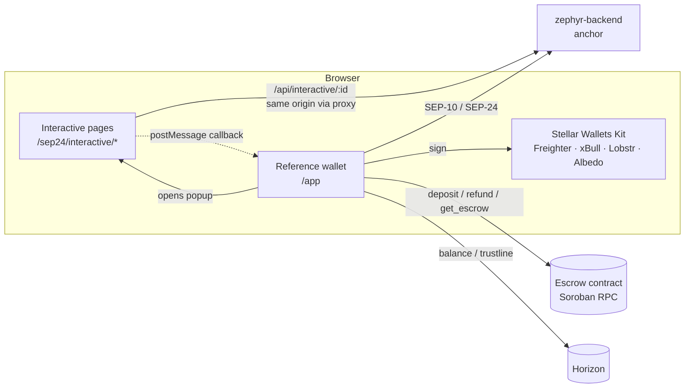
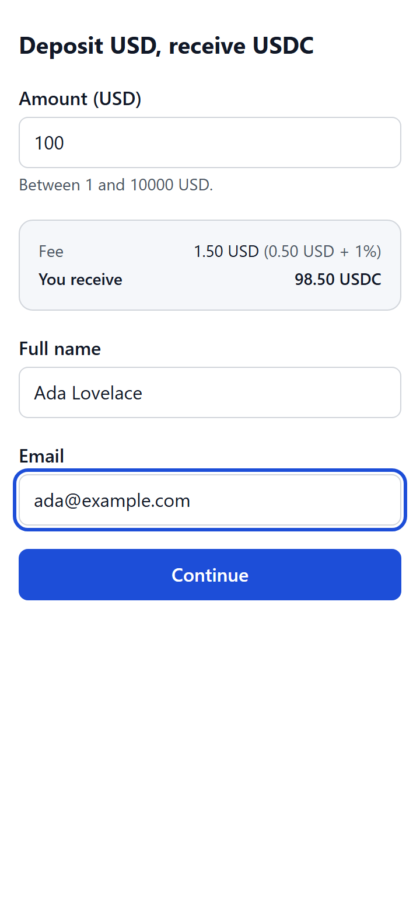
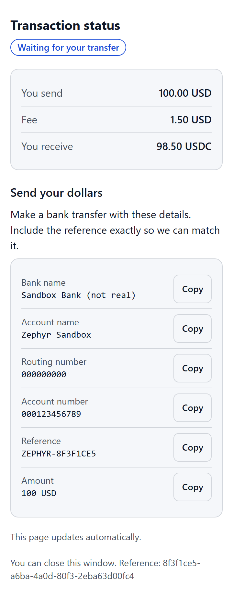
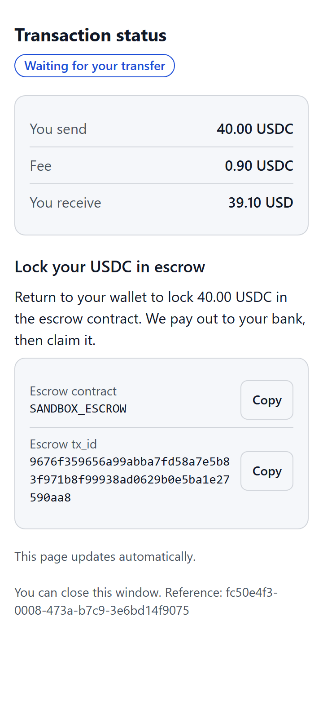
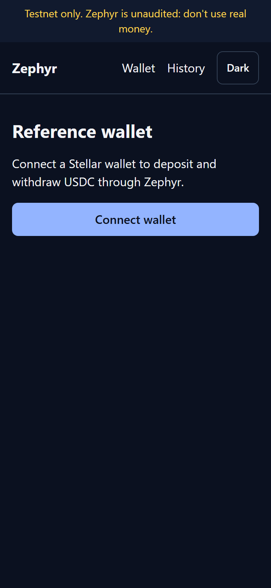

# Zephyr Frontend

[](https://github.com/zephyr-ramp/zephyr-frontend/actions/workflows/ci.yml)
[](LICENSE)


The web side of **[Zephyr](https://github.com/zephyr-ramp)**, an open-source USD ⇄ USDC on/off-ramp on Stellar:

1. **SEP-24 interactive pages** (`/sep24/interactive/*`): the deposit/withdraw form and status pages that any SEP-24 wallet opens in a popup or webview. Mobile-first; works at 360px wide.
2. **A reference wallet** (`/app`): connect Freighter, xBull, Lobstr or Albedo, sign in with SEP-10, add a USDC trustline, deposit, withdraw (including through the **escrow contract**), refund an expired escrow, and see your history.

> [!WARNING]
> **Testnet only, unaudited.** Don't use Zephyr with real money.

## How it connects

| Repo                                                                | Relationship                                                                                                                                                                                                                            |
| ------------------------------------------------------------------- | --------------------------------------------------------------------------------------------------------------------------------------------------------------------------------------------------------------------------------------- |
| [zephyr-backend](https://github.com/zephyr-ramp/zephyr-backend)     | Serves this app's interactive pages on the anchor's domain (proxy at `/sep24/interactive/*`). The pages call its `/api/interactive/:id`. The wallet calls its SEP-10/SEP-24 endpoints. API types are generated from its `openapi.yaml`. |
| [zephyr-contracts](https://github.com/zephyr-ramp/zephyr-contracts) | The wallet builds and signs escrow `deposit` / `refund` calls with the generated client `@zephyr-ramp/escrow-client` (vendored in `vendor/`).                                                                                           |



## Quick start

Requirements: Node.js 20+, and a running [zephyr-backend](https://github.com/zephyr-ramp/zephyr-backend) (see its quick start).

```bash
npm install
cp .env.example .env.local
npm run dev            # http://localhost:3000
```

Open `http://localhost:3000/app`. To see the interactive pages as a wallet does, set `FRONTEND_URL=http://localhost:3000` in the backend's `.env`. The backend then proxies `/sep24/interactive/*` here, and interactive URLs point at them.

Or run everything with Docker from the backend repo: `docker compose up --build` (expects this repo at `../zephyr-frontend`).

## Configuration

| Variable                         | Default                 | Description                                                                                                                                                                    |
| -------------------------------- | ----------------------- | ------------------------------------------------------------------------------------------------------------------------------------------------------------------------------ |
| `NEXT_PUBLIC_ANCHOR_URL`         | `http://localhost:8080` | zephyr-backend base URL                                                                                                                                                        |
| `NEXT_PUBLIC_NETWORK`            | `testnet`               | `testnet` or `public`                                                                                                                                                          |
| `NEXT_PUBLIC_ESCROW_CONTRACT_ID` | _(none)_                | Escrow contract. Enables "Withdraw with escrow". The wallet refuses to lock funds into any other contract. Testnet: `CCQCVQTYB45FXJG6BPLR4RPBMBOE4VD73MUMTDWT6Q55TXINSEBV3IOQ` |
| `NEXT_PUBLIC_SOROBAN_RPC_URL`    | testnet RPC             | Soroban RPC for escrow calls                                                                                                                                                   |
| `NEXT_PUBLIC_USDC_ISSUER`        | Circle testnet issuer   | USDC asset for balances and trustlines                                                                                                                                         |

`NEXT_PUBLIC_*` values are compiled into the client bundle at build time.

## Try it on testnet

1. Install [Freighter](https://www.freighter.app/) and switch it to **Testnet**. Fund the account with Friendbot.
2. Open `/app` → **Connect wallet** → **Sign in to Zephyr** (SEP-10; no funds move) → **Add USDC trustline**.
3. **Deposit:** click **Deposit USD**, fill in the popup form, then play the bank on the backend: `curl -X POST localhost:8080/sandbox/deposits/<id>/fiat-received`. USDC arrives and the status turns _Completed_.
4. **Escrow withdrawal:** click **Withdraw with escrow** and choose _Escrow contract_ in the form. You land on `/app/escrow`, where **Sign and lock** calls the contract's `deposit`. The backend sees `locked`, pays out (mock bank) and `claim`s, and the page shows _Claimed by the anchor after payout_. If the anchor never acts, **Refund my USDC** appears once the deadline passes.

## Screenshots

Captured at 360px wide by `scripts/demo-sandbox.mjs` against a local backend in sandbox mode.

| Deposit form (live fee)                                                           | Bank instructions                                                               | Escrow withdrawal                                                               | Wallet (dark)                                                  |
| --------------------------------------------------------------------------------- | ------------------------------------------------------------------------------- | ------------------------------------------------------------------------------- | -------------------------------------------------------------- |
|  |  |  |  |

To regenerate them, run the backend with `ENABLE_SANDBOX=true FRONTEND_URL=http://127.0.0.1:3000`, then `npm run build && npx next start -p 3000 -H 127.0.0.1` here, then `node scripts/demo-sandbox.mjs`.

## Project layout

```
app/
  (site)/            Landing page and reference wallet (/app, /app/history, /app/escrow)
  sep24/interactive/ deposit, withdraw and more-info pages (minimal chrome for webviews)
components/          TransferForm, StatusView, InteractiveFlow, EscrowPanel, WalletHome, …
lib/
  amount.ts          BigInt decimal math + the anchor's fee formula
  api/               Typed client; schema.d.ts is generated from the backend's openapi.yaml
  auth.ts            SEP-10 login (refuses to sign anything but a challenge)
  escrow.ts          Escrow calls through @zephyr-ramp/escrow-client
  wallet.ts          Stellar Wallets Kit wrapper
  i18n/en.ts         Every user-facing string
test/                Vitest + Testing Library (+ axe-core) component tests
e2e/                 Playwright smoke test (360px, mocked backend, axe incl. contrast)
```

## Development

```bash
npm test               # component + unit tests (offline)
npm run test:coverage
npm run test:e2e       # builds, serves, runs Playwright (npx playwright install chromium first)
npm run lint && npm run format:check && npm run typecheck
npm run api:types      # regenerate lib/api/schema.d.ts from ../zephyr-backend/openapi.yaml
npm run bindings:update  # re-vendor @zephyr-ramp/escrow-client from ../zephyr-contracts
```

## Accessibility

Target: **WCAG 2.1 AA**. Every input has a visible label and linked error messages (`aria-invalid`, `aria-describedby`). Focus is always visible, and the first invalid field is focused on submit. Status changes are announced (`aria-live`), and touch targets are at least 44px. The light and dark themes both meet 4.5:1 contrast. Component tests run axe-core on every major component, and the Playwright test runs axe (including contrast) on real pages in both themes at 360px.

## Security

- The SEP-10 JWT lives **in memory only** (React state), so reloading signs you out. The interactive token only ever travels in the URL the wallet opened.
- Before signing a SEP-10 challenge, the app checks it's a zero-sequence, `manage_data`-only transaction.
- Escrow locks are only allowed into `NEXT_PUBLIC_ESCROW_CONTRACT_ID`.
- The wallet accepts popup `postMessage`s only from the anchor's origin.
- Amounts use exact BigInt math, and ESLint bans `parseFloat`.

See [SECURITY.md](SECURITY.md) to report a vulnerability.

## Roadmap

- [x] Interactive deposit/withdraw with live fees, status pages, more_info page
- [x] Reference wallet: SEP-10, trustline, deposit, standard + escrow withdrawal, refund, history
- [x] Light/dark themes, i18n scaffolding, axe checks
- [ ] More languages (Spanish, French, Portuguese…)
- [ ] More wallets (Hana, Rabet, WalletConnect)
- [ ] SEP-12 KYC screens
- [ ] PWA / offline shell
- [ ] Visual regression tests

## Contributing

See [CONTRIBUTING.md](CONTRIBUTING.md). Pick a `good first issue` and **wait to be assigned**. Zephyr is part of [Drips Wave](https://www.drips.network/wave) (Trivial 100 / Medium 150 / High 200 points).

## License

[Apache-2.0](LICENSE)
